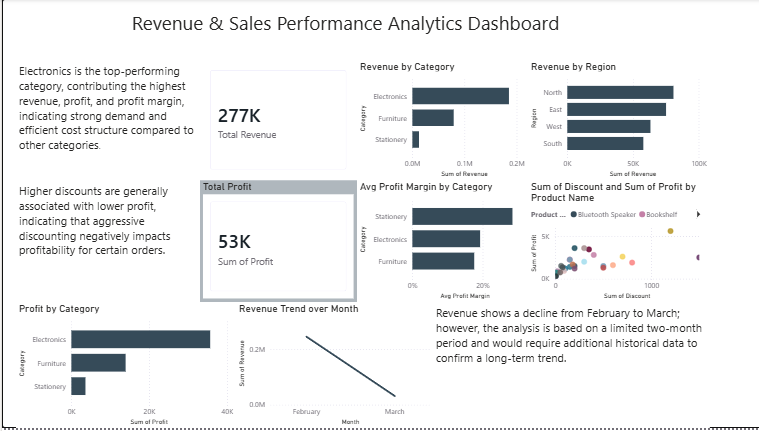
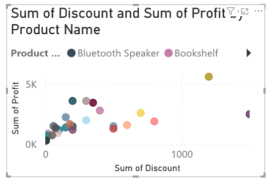
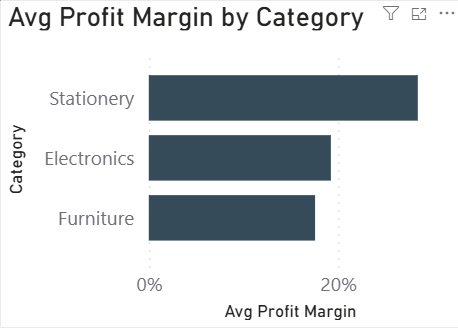

# Revenue & Sales Performance Analytics Dashboard

## Overview
This project focuses on analyzing sales performance using Power BI. The dashboard provides insights into revenue, profit, and profitability across product categories and regions, as well as the impact of discounting on profits. It also includes a time-based analysis to understand revenue trends over months.

## Tools Used
- Power BI Desktop
- DAX (for calculated measures)
- Excel (for sample dataset, if applicable)

## Key Features
- Total Revenue, Total Profit, and Average Profit Margin KPIs
- Category-wise and Region-wise Revenue & Profit Analysis
- Discount vs Profit Scatter Chart
- Revenue Trend Over Time
- Professional insights added in text boxes

## Screenshots

### Dashboard Overview

### Discount vs Profit Analysis

### Profit Margin & Revenue Trend

## Key Insights
- Electronics is the top-performing category in terms of revenue and profitability.
- Higher discounts often reduce profitability, visible in the scatter chart.
- Revenue declined from February to March, based on the available dataset (limited time period).
- Average Profit Margin was calculated using a DAX measure to ensure correct aggregation.

## Notes
- All measures and calculations are built using Power BI Desktop.
- The dashboard is suitable for business decision-making and provides executive-level insights.
